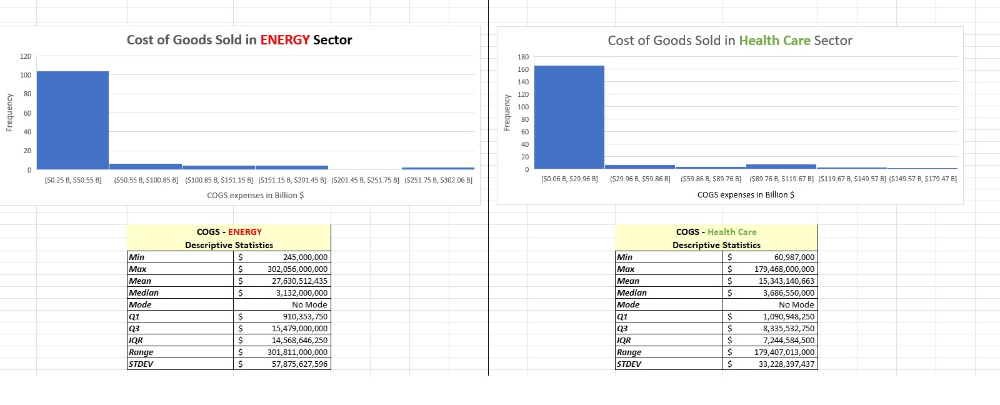
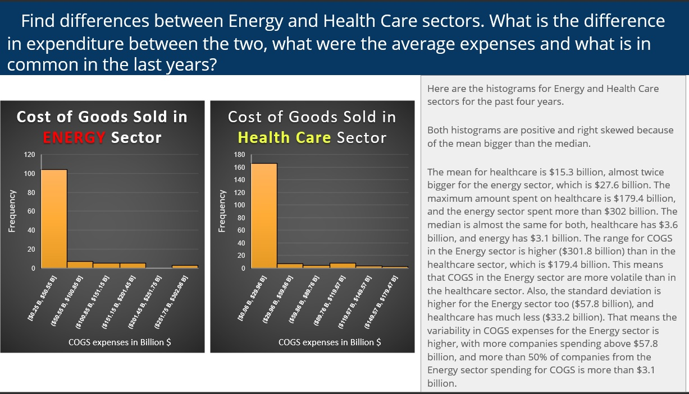
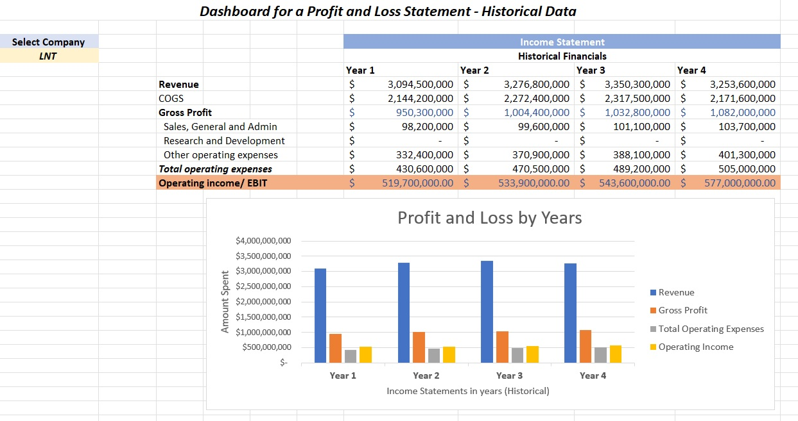
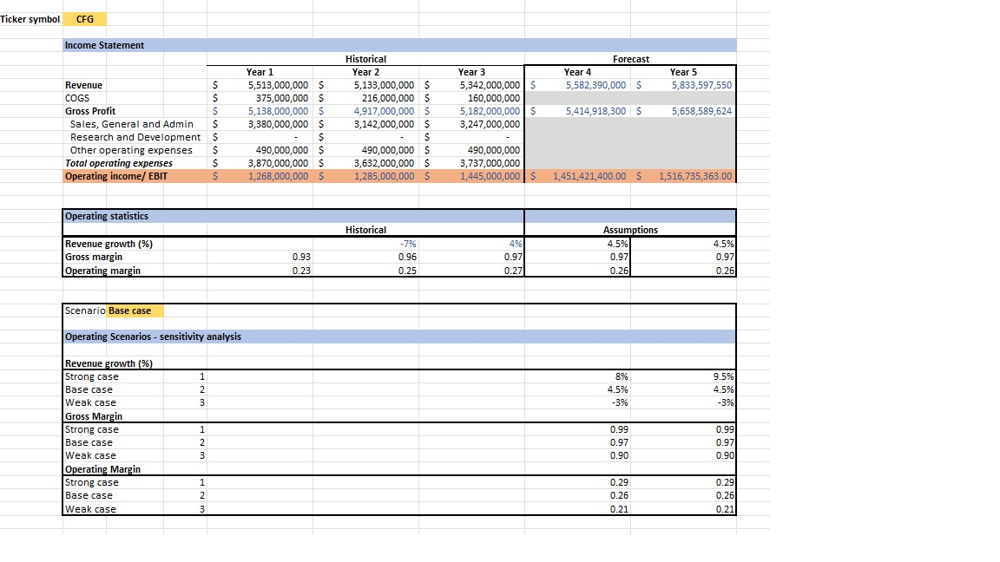

# Analyze-The-New-York-Exchange-NYSE-Dataset

#### About this project

> In This project, I will analyze real-life data from the New York Stock Exchange. I will be drawing a subset of a large dataset provided by Kaggle that contains historical financial data from S&P 500 companies. During this project, I will conduct three Tasks:
> - Complete my own data analysis and create a presentation to share my findings.
> - Develop a dashboard for a Profit and Loss Statement.
> - Create a Financial Forecasting Model using three scenarios.

#### Background
> I used the Fundamentals.csv and Securities.csv files provided by Kaggle. The Fundamentals file provides the fundamental financial data gathered from SEC 10K annual filings from 448 companies listed on the S&P 500 index. The Securities file provided the industry or sector information the companies are categorized under on the S&P 500 index.

#### Skills I will use

> - Calculating summary statistics
> - Drawing any inference from the statistics
> - Calculating business metrics
> - Using models to forecast future growth prospects for the companies
> - Interpret the measures of central tendency and spread (mean, median, standard deviation, range).
> - Use a combination of Excel functions (e.g., If statements, INDEX, and MATCH, calculating descriptive statistics with IF statement, dropdowns, data validation, VLOOKUP).
> - Analyze and forecast financial business metrics using Excel.
> - Create visualizations of a business metric and use Excel to create a financial forecast model.

### Cleaning Up The Data

- Make a copy of original data
- Change all the column names to informative names that have no spaces
- Set up named ranges for the data
- Make sure that the "$-" data which is interpreted as "$0"
- Changing dates and numbers to the right format (Using text to columns)

## Task 1: Preliminary analysis of the dataset

> In this task, I am going to compare the Cost of goods Sold in 2 sectors, Energy and Healthcare.

- Create a Descriptive Statistics table of each Sector over 4 years
- Create a Histogram
- Create a slide presentation, ask a question and answer it based on the data

## Task 2: Develop a dashboard for a profit and loss statement

- Create data validation (list) to select which company we want
- Add revenue, calculate all expenses for each year, using INDEX/MATCH
- Create a bar chart

## Task 3: Create a financial model

> I have chosen the CFG ticker symbol for this task.

### Historical

- Create Income Statement for each year
- Calculate Operating statistics (Revenue growth, Gross margin, Operating margin)
- Create Operating Scenarios - sensitivity analysis
- Create data validation for 3 cases(Strong case, Base case, Weak case)

### Forecast

- Define Revenue growth, Gross margin, and Operating Margin for each case for year 4 and year 5
- Calculate Assumptions for Operating statistics
- Finally, calculate the forecast for Income Statement ( Revenue, Gross Profit, Operating income/ EBIT)

